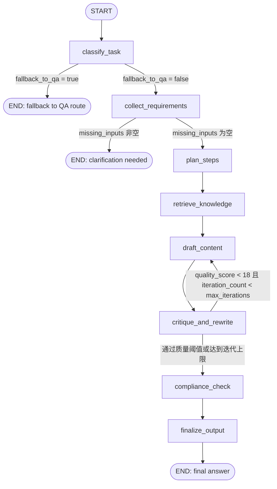

# ComplexTaskAgentRoute Graph 结构图

下面是新增复杂任务路由对应的 LangGraph 流程图（Mermaid）：

## 节点说明（与代码一一对应）

1. `classify_task`：识别是否为复杂内容生产任务。
2. `collect_requirements`：检查必要槽位，缺失则触发澄清。
3. `plan_steps`：生成执行计划。
4. `retrieve_knowledge`：调用 Milvus 检索证据。
5. `draft_content`：按模板 + 语气 + 证据生成草稿。
6. `critique_and_rewrite`：质量评分，不达标回环重写。
7. `compliance_check`：执行合规检查。
8. `finalize_output`：拼装最终可流式返回内容。
